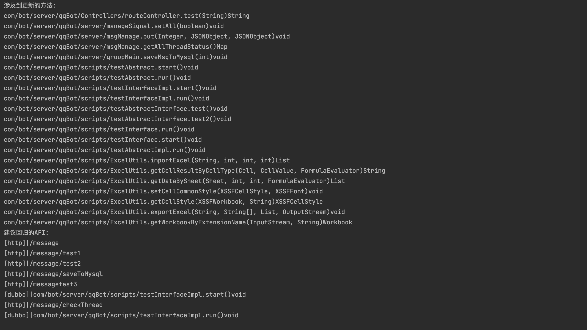

### 这是什么:

用于静态分析Java工程的调用链，对比新老分支代码的差异，并给出受到影响的接口作为建议，通俗一点地说：能够通过一段修改过的代码，推断出测试要回归哪些接口用例

### 设计思想：

* 名词解释：
  * 调用关系：在A方法中调用了B方法，则形成一条调用关系 A->B
  * 调用链：从方法A开始，一层层追溯其所有调用关系，如：A->B->C->D，这样一条完整的调用关系链，在此称之为调用链
  * 抽象语法树：是源代码**语法**结构的一种**抽象**表示。 它以**树**状的形式表现编程语言的**语法**结构，**树**上的每个节点都表示源代码中的一种结构。
* 核心原理：
  * 通过字节码工具，检索工程项目内的所有编译好的字节码文件(.class)，获取项目内所有方法的「调用关系」；
  * 定义项目内的Controller类的方法为入口，由「调用关系」递归或循环，得到每一个api的「调用链」
  * 通过语法树工具，将项目内的源码文件(.java)解析为语法树，可以很容易地对比两个分支的语法树，并得到新分支内被修改过，或者新增的方法；
  * 遍历所有「调用链」，检查每一条调用链内是否存在被修改或更新的方法，若存在则认为本次代码更新影响到了此条调用链；
  * 收集所有被影响到的「调用链」，我们有理由认为，这些调用链的入口，也就是对应的Controller类的api在本次需求迭代中有更新，需要参与测试或回归测试

### 如何使用：

（注：仅用于分析springboot的项目）

1.首先把你需要分析的项目代码clone两份，一份checkout到master，另一份可以checkout到dev(或者其他分支)，这样表示对比这两个分支的代码

2.打开 src/main/resources/config.json

```
{
  "oldProjectPath": "/Users/xiaoandi/github/qqbot/qqbot",
  "newProjectPath": "/Users/xiaoandi/github/qqbot/diff_test/qqbot",
  "source": "src/main/java",
  "target": "target/classes",
  "resources": "src/main/resources"
}
```

设置好以上路径，比如：

* oldProjectPath填master分支的路径（会自动检索项目下的所有子模块）;
* newProjectPath填dev分支的路径（同上）
* source：代码路径，不用改
* target：maven编译出来的路径，不用改
* resources：资源路径，不用改
* 编译newProjectPath项目，得到target（需要把所有子模块全部编译，oldProject不需要编译）
* 运行 main 即可得到结果
* 如果要打包，执行mvn命令：[mvn assembly:assembly] 得到 `static-chain-analysis-1.0-SNAPSHOT-jar-with-dependencies.jar`
* 这样表示: 对于dev分支新增、修改过的源码将会被分析调用链关系。注意，相较于oldProject，newProject里删除的源码文件将不会加入分析，因为那没多大意义。
* oldProjectPath和newProjectPath路径最后不需要加上"/"
* 可能存在某些代码结构未考虑到，如果报错了可以沟通交流解决

### 更新计划

* [X]  支持检测mybatis的xml配置变动
* [X]  支持dubbo接口的调用链（从注解）
* [ ]  支持dubbo接口的调用链（从xml）
* [ ]  支持SpringCloud的rpc接口
* [X]  为这个垃圾工具增加了一个web页面，可手动选择分支以及精确到具体的commitId来分析[static-chain-analysis-web](https://github.com/F-JH/static-chain-analysis-web)

##### 效果图如下：


